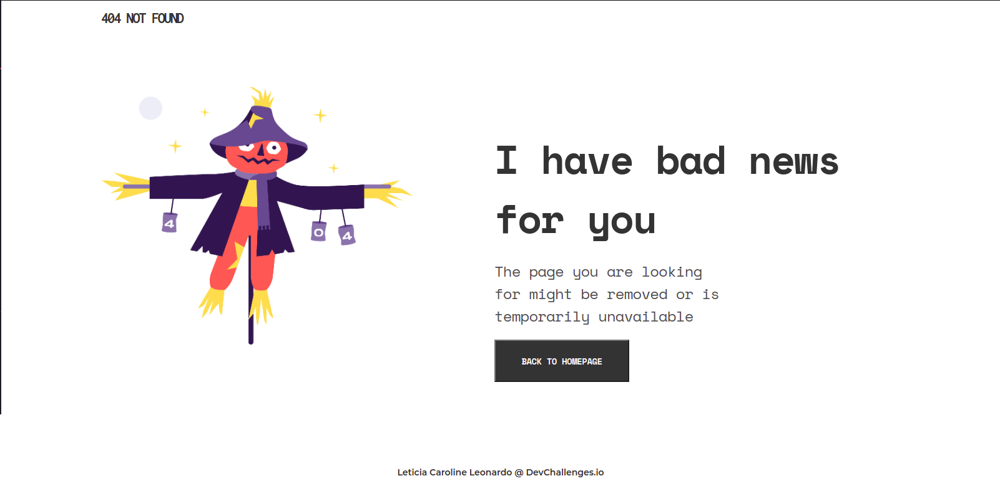

  

<h1 align="center">404 Not Found</h1>

### :pencil2: Sobre o projeto
**Challenge:** Create a 404 not found page following the design. The page should be responsive. 

### :computer: Tecnologias utilizadas
- HTML
- CSS with Flexbox
-------------------------------------------------------

Feito com :hearts: por <a href="https://github.com/levxyca">Leticia Caroline Leonardo</a>

